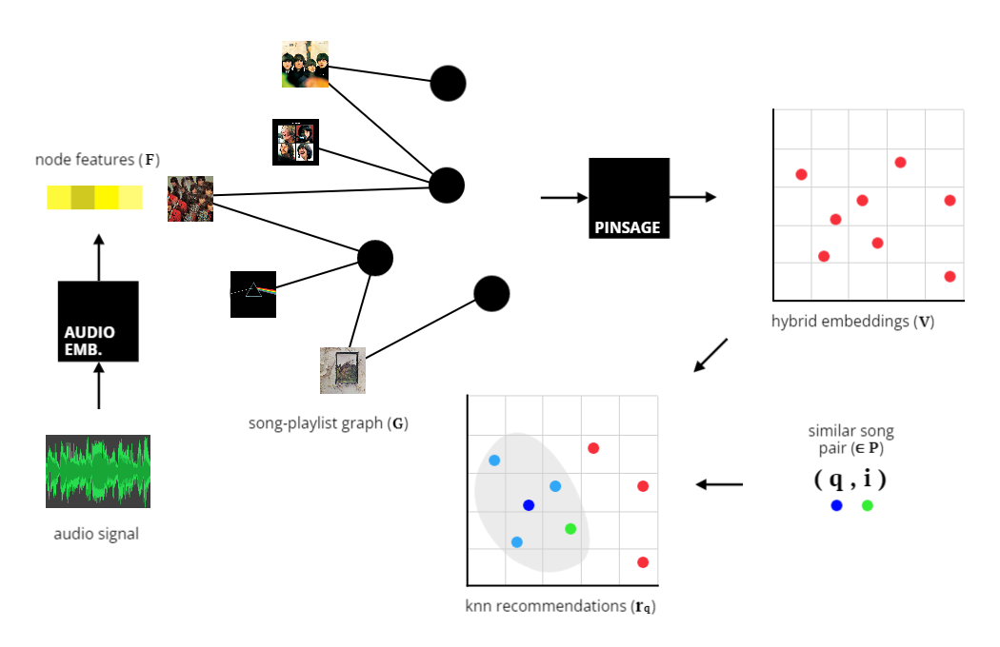

# Hybrid music recommendation with graph neural networks 

An implementation of PinSage as a music recommender, evaluated against CF, graph-based methods and content-based methods.



After installing dependencies, run the following command to reproduce results:
```
	python dashboard.py all
```
See `dashboard.py` for more details on usage.
